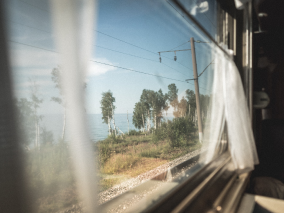

<h2 align="center"></h2>
<h2 align="center"></h2>
<h2 align="center"></h2>

# Проект: Путешествие по России

Проект о том как и где можно путешествовать в нашей стране. С описанием наиболее интересныхк посещению мест
Проект сверстан при помощи макета из Figma
Использованы технологии грид таблиц и также флексбокса
* [Ссылка на макет в Figma](https://www.figma.com/file/5S2WSbEFL6awjVWJ0NWL8Q/Sprint-3_-Russia-_-desktop-mobile?node-id=28503%3A0)

https://george051191.github.io/russian-travel/
ссылка на проект

